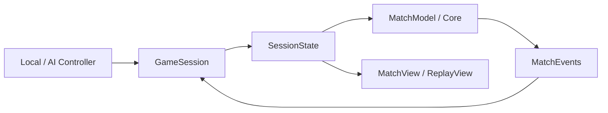

# YuJanggi

> 게임 규칙을 Unity와 분리하고, 상태별로 입력과 화면 갱신을 통제한 Unity 6 기반 장기 게임입니다.

Local, AI, Replay 모드를 구현했습니다. 장기 규칙은 Unity API를 참조하지 않는 [YuJanggi.Core](https://github.com/SeokJinYoo98/YuJanggi.Core)에 두고, Unity Runtime은 입력과 화면 표현을 담당하도록 분리했습니다. Unity와 .NET 서버가 같은 Core 저장소의 커밋을 참조하도록 구성해 온라인 대전으로 확장하고 있습니다.

[포트폴리오](https://app.notion.com/p/3b28a299d1c480ed867fef02568ca410) | [실행 파일](https://app.notion.com/p/38e8a299d1c48043b6a8f045695abf57) | [온라인 서버 확장](https://github.com/SeokJinYoo98/ChattingServer)

## 프로젝트 정보

| 항목 | 내용 |
| --- | --- |
| 개발 기간 | 2026.03부터 개발 중 |
| 개발 인원 | 1명 |
| 담당 | 기획, 구조 설계, 장기 규칙, Unity 연동, UI, 연출 |
| 개발 환경 | Unity 6000.3.1f1, C#, URP |
| 주요 기술 | UniTask, DOTween, ScriptableObject, Object Pool |

## 주요 기능

| 구분 | 구현 내용 |
| --- | --- |
| 장기 규칙 | 기물 이동, 궁성 규칙, 합법 수 필터링, 장군, 외통수, 결과 판정 |
| 대국 모드 | Local 대국, AI 대국, Live 중 기보 탐색, 종료 후 Replay |
| 대국 관리 | 턴 진행, 한 수 쉼, 무르기, 기권, 점수, 기보 기록 |
| 화면 표현 | 선택 기물과 합법 수 표시, 이동 애니메이션, 캡처 파티클, 사운드, 결과 UI |

## 전체 구조



Controller는 이동 요청만 만들고, Core가 규칙과 상태 변경을 처리합니다. `GameSession`은 현재 상태에 맞는 입력과 이벤트만 `MatchView` 또는 `ReplayView`에 전달합니다.

<details>
<summary>기존 구조 이미지 보기</summary>


</details>

## 핵심 구현

### 1. Core와 Unity Runtime 분리

규칙이 Unity 생명주기에 묶이지 않도록 별도 저장소인 [YuJanggi.Core](https://github.com/SeokJinYoo98/YuJanggi.Core)에 다음 책임을 배치했습니다.

- `Board`: 9 x 10 보드와 기물 상태
- `Rule`: 기물별 이동 후보와 합법 수 검증
- `Match`: 이동 실행, 턴, 점수, 기보, 승패 판정
- `Domain`: 좌표, 기물, 진영, 선택 상태

[`Assets/Scripts/Runtime`](Assets/Scripts/Runtime)은 입력, UI, View, 사운드를 담당합니다. 실행 방식과 화면 표현이 달라도 Local과 AI가 같은 Core 규칙을 사용합니다.

### 2. SessionState로 Live와 Replay 충돌 해결

Replay 기능을 추가하면서 Live용 화면 갱신과 Replay용 화면 갱신이 같은 View를 제어해 이벤트 중복 호출과 상태 동기화 문제가 발생했습니다.

[`GameSession`](Assets/Scripts/Runtime/GameSession/GameSession.cs)이 이벤트 흐름을 중재하고, 동작을 다음 상태로 분리했습니다.

- `LiveState`: 이동, 선택, 무르기, 한 수 쉼, 기권 처리
- `ReplayState`: 진행 중인 대국의 이전 수와 다음 수 탐색
- `EndState`: 대국 종료와 결과 처리
- `EndReplayState`: 종료된 대국의 기보 탐색

상태마다 허용되는 입력과 View 갱신을 분리하고, 공통 동작은 [`SessionStateBase`](Assets/Scripts/Runtime/GameSession/State/GameSessionState.cs)에 모았습니다.

### 3. Rule Pipeline으로 합법 수 계산 단계 분리

[`JanggiRule`](https://github.com/SeokJinYoo98/YuJanggi.Core/blob/main/Runtime/Match/Rule/JanggiRule.cs)은 규칙 계산을 다음 순서로 처리합니다.

1. `MovementRule`이 기물별 이동 패턴으로 후보 칸 생성
2. `PalaceRule`이 궁성 대각선과 궁, 사, 졸의 이동 제한 적용
3. 후보 수를 임시 실행한 뒤 왕이 장군 상태인지 검사
4. 보드를 원상 복구하고 불법 수 제거

후보 생성과 합법성 검증을 분리했으며, AI도 같은 `IJanggiRule`을 통해 이동 가능한 수를 계산합니다.

### 4. 입력 방식을 이동 요청으로 통합

[`LocalController`](Assets/Scripts/Runtime/Controller/LocalController.cs)와 [`AIController`](Assets/Scripts/Runtime/Controller/AIController.cs)는 모두 출발 좌표와 도착 좌표를 가진 이동 요청을 `GameSession`에 전달합니다.

AI 턴은 UniTask와 `CancellationTokenSource`로 처리해 턴이 끝나거나 대국이 초기화될 때 실행 중인 작업을 취소합니다. 입력 출처가 달라도 이후 검증과 상태 변경 흐름은 동일합니다.

### 5. Unity 화면 표현과 반복 생성 관리

- [`PieceView`](Assets/Scripts/Runtime/Piece/PieceView.cs): DOTween으로 기물 이동을 표현하고 중복 Tween을 정리
- [`ParticleView`](Assets/Scripts/Runtime/Particle/ParticleView.cs): 캡처 파티클을 Object Pool에서 재사용
- [`MoveGuideView`](Assets/Scripts/Runtime/Board/MoveGuideView.cs): 이동 가능 위치 표시 오브젝트 재사용
- [`PieceData`](Assets/Scripts/Data/PieceData.cs): 기물 종류, 진영, Mesh를 ScriptableObject로 관리
- `IBoardClickable`: 클릭 대상이 보드 좌표를 직접 제공해 입력 계층의 좌표 계산 의존 제거

## Core 검증과 온라인 서버 확장

온라인 대전을 준비하며 Core를 독립된 .NET 10 및 Unity UPM 패키지로 분리하고, MSTest로 장기 규칙 테스트 20건을 작성했습니다.

테스트 과정에서 `MatchModel.TryMove()`가 현재 턴과 출발 기물의 진영을 비교하지 않는 결함을 발견했습니다. 상태 변경 전에 턴 소유권을 검사하도록 수정하고, 잘못된 이동 이후 보드, 턴, 점수, 기록이 유지되는지 회귀 테스트로 확인했습니다.

[공용 Core와 테스트](https://github.com/SeokJinYoo98/YuJanggi.Core) | [턴 소유권 수정 커밋](https://github.com/SeokJinYoo98/ChattingServer/commit/ffec1fdc8dae0ad2e690abd7502412cc9bac6a99) | [온라인 개발 계획](https://github.com/SeokJinYoo98/ChattingServer/blob/main/ToDo.md)

현재 TCP 길이 헤더와 JSON 메시지, 비동기 접속과 송신 제어까지 구현했습니다. 방 관리, 서버 이동 처리, Unity 네트워크 연결은 개발 중입니다.

## 프로젝트 구조

```text
Packages
└── com.seokjinyoo.yujanggi.core → YuJanggi.Core
Assets/Scripts
├── Data
└── Runtime
    ├── Board
    ├── Controller
    ├── GameSession
    ├── Input
    ├── Particle
    ├── Piece
    └── UI
```

## 실행 방법

1. 저장소를 Clone합니다.
2. Unity Hub에서 Unity `6000.3.1f1`로 프로젝트를 엽니다.
3. Unity Editor에서 Play를 실행합니다.

## 진행 중인 작업

- Android 포인터 입력과 드래그 조작
- 화면 비율과 Safe Area 대응
- Android 생명주기와 실제 단말 검증
- 서버 권위형 온라인 대전 연결
- AI 판단 로직 고도화
- Replay 저장과 불러오기

모바일 확장 작업의 범위와 완료 조건은 [TODO.md](TODO.md)에 정리했습니다.

## 사용 에셋

- 장기말: [장기 Janggi KOREA Ver 접이식 장기판 버전](https://www.acon3d.com/ko/product/1000013872)
- UI와 배경: Aseprite로 직접 제작
- 사운드: [Pixabay Chess Sound Effects](https://pixabay.com/sound-effects/search/chess/)
